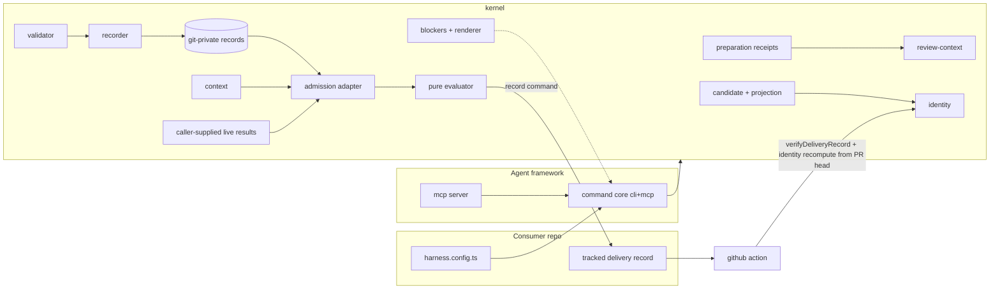

# feat: Delivery Harness standalone v1 — kernel, validator, CLI/MCP, GitHub Action

**Target repo:** `delivery-harness` (greenfield — to be created; this plan lives in Athena because the target repo does not exist yet). All file paths below are relative to the target repo unless prefixed `athena:`, which marks source-material references in the Athena monorepo that units port from.

## Summary

Build v1 of the standalone delivery harness as a new open-source TypeScript monorepo: a config-driven kernel ported from Athena's harness scripts, a reference validator that passes the delivery-evidence/1 conformance kit (89 vectors), a CLI + MCP submission surface, and a GitHub Action that verifies a tracked delivery record on agent PRs — sequenced in three phases so each is independently shippable, ending with the repo gating its own PRs.

---

## Problem Frame

Athena's delivery harness makes agent-delivered merges trustworthy — evidence binds to exact trees, agents cannot waive or self-certify, review spend is protected by mechanical ordering — but it is welded to one repo through two data registries, hardcoded path/ref literals, and Bun-only process APIs. The delivery-evidence/1 spec and its conformance kit (produced earlier in this effort) define the portable contract; nothing yet implements it outside Athena. Without a standalone implementation, no other project or agent framework can adopt the model, and the open-core packaging strategy has no OSS layer to anchor it.

---

## Requirements

- R1. A reference validator implements the delivery-evidence/1 envelope and the review.green/1 payload, passes all 89 conformance-kit vectors (8 accept, 81 reject) honoring the kit's subset-code semantics, and publishes the spec's JSON Schemas cross-checked against every vector under a named, vector-keyed partition (schema-expressible rejections and all accepts).
- R2. The kernel is config-driven: gate id, base ref, neutral-path matchers, identity versions, storage namespace, provider registry (with per-provider finding-code surfaces), obligations (with remediation catalogs, exact waivable/non-waivable code partitions, and minimum attestation levels), accepted envelope and payload specs, path-classification matchers, sensitive-path activation patterns, delivery-record path and verification policy, agent env signals, CI delegation policies, and preparation wiring paths are all injected via an explicit config parameter. The kernel never reads ambient env or repo-specific constants at import time.
- R3. The recorder implements the submission contract: preparation-receipt-gated review context, recorder-allocated run roots, artifact digest and containment verification, strict candidate re-capture at submission comparing an enumerated field set including raw `treeSha`, `headSha`, and `workspaceId` (SUB-1/2/3), atomic per-claim content-addressed records keyed by the spec's SUB-4 identity (with a discriminated waiver variant) with idempotent republish and conflict rejection, and all-violations rejection reporting (SUB-5) at both validator and recorder layers.
- R4. The gate evaluator resolves obligations as one of six enumerated, non-interchangeable outcomes, judges evidence freshness by deliverable identity (not raw tree, exactly and only at gate time), and enforces the execution-context trust asymmetry: recognized agents can never waive, interactive humans may waive only waivable codes via a prompt that names everything one "yes" covers, and CI delegation requires an exact-match declared policy. Live-fact results enter only as caller-supplied provider results through the admission adapter.
- R5. A CLI provides the full loop — `prepare`, `review-context`, `submit-evidence`, `gate`, `record`, `verify`, `check` — with typed blockers rendered through one total, redacting, neutralizing renderer, stable machine-readable codes, deduplicated remediations, and distinct exit semantics for policy blocks, usage errors, and interruption.
- R6. An MCP server exposes `review-context` and `submit-evidence` to agent frameworks as a strict-parity wrapper over the same command core as the CLI, including the usage-error class.
- R7. Accepted evidence can be promoted into a tracked **delivery record** (`delivery-record/1`, a product-layer projection outside the delivery-evidence/1 spec) carrying candidate binding, claim outcomes, `manifestDigest`, `workspaceId`, and attestation level; its config-declared path is a member of both neutral sets so writing it perturbs neither review evidence nor its own attested identity; a GitHub Action verifies it on PRs by recomputing deliverable identity from the PR head and fails closed on identity mismatch, base drift (staling by default), missing/untracked record, or uncovered obligations.
- R8. Node ≥ 22 is the primary runtime (engines floor; Node 20 is EOL since 2026-04); Bun runs the same suite in the CI matrix; all process control uses `node:child_process`; Bun-only APIs are banned by static sensor, not by review vigilance.
- R9. Published documentation: the delivery-evidence/1 spec, the delivery-record/1 note, a getting-started guide, a provider implementation guide, and conformance-kit usage — with executable docs examples.
- R10. Self-hosting: the repo's own PRs are gated by its own Action and conformance suite, with release mechanics (license, publish dry-run, version consistency) in place.
- R11. Every sensor, validator, and policy invariant introduced by this plan is falsified in tests (re-break, confirm red, restore; anti-vacuity assertions on every scan root), and config-independence is proven by two synthetic configs: a kit-variant config (varying every vector-independent dimension) driving kit runs at each phase boundary, and a full-divergence config (varying everything except the values v1 scope fixes) driving the kernel suite.

---

## Scope Boundaries

- No L1/L2 attestation: no signing profile, no signature verification. The only conforming `attestation.level` in v1 is `self`; any other defined level yields `unsupported_attestation` regardless of the signatures array, and a non-empty signatures array yields it too (spec ENV-12/13, §7).
- No hosted control plane: no dashboards, hosted waiver approvals, or fleet telemetry SaaS.
- No knowledge-compounding module: solution notes, landed-change reports, quizzes, and their sensors stay out of v1.
- No human-review-process adapter (GitHub-approvals-to-manifest bridging).
- No payload specs beyond review.green/1.
- No port of Athena-only machinery: passkey waiver stack, Convex static analyzer, behavior-scenario runner, graphify.
- No kernel-side guarded provider-command execution: the pure evaluator and admission adapter evaluate caller-supplied records and live results without spawning consumer validation suites. The opt-in CLI-boundary provider rail may obtain those same inputs from configured commands without moving orchestration into the kernel.
- No Windows support in v1 (macOS + Linux; Windows is follow-up).
- No naming/branding/pricing decisions — `delivery-harness` and `@delivery-harness/*` are working names.

### Deferred to Follow-Up Work

- Athena adopting the extracted kernel as its own harness core: separate effort in the Athena repo after v1 stabilizes.
- GitHub App (hosted verification, PR comments, org install): follow-up once the Action proves the loop.
- Guarded provider execution (gate-owned spawning of consumer validation commands with candidate re-capture around the spawn, per Athena's admission design).
- L1 signing profile: requires an implementing agent-framework vendor at the table.
- Conformance-kit publication as a versioned npm package with an independent release cadence.
- Multi-gate support: v1 declares exactly one `gateId` in config (it participates in record identity and filenames); multiple gates per repo are deferred.

---

## Context & Research

### Relevant Code and Patterns (source material in Athena)

- `athena:scripts/harness-candidate.ts` (447 lines) — double-observation candidate capture, prepared-state rules, path classification, activation projection.
- `athena:scripts/harness-review-identity.ts` (172 lines) — deliverable-tree identity, NUL-stream `ls-tree` parsing, byte-order sort, the two-neutral-sets design (`REVIEW_NEUTRAL_PATH_PREFIXES` and the prefix+suffix `isPostGateValidationNeutralPath`).
- `athena:scripts/harness-obligation-records.ts` (453 lines) — content-addressed git-private records, tmp+link atomic publish, workspace id derivation, the discriminated waiver identity (`{kind: "waiver"}`). (Its `stableJson` is locale-dependent and is deliberately NOT ported.)
- `athena:scripts/harness-gate-obligations.ts` (854 lines) — pure evaluator, six resolution kinds, freshness and waiver scoping, `enforceAllowedResolution`.
- `athena:scripts/harness-gate-admission.ts` (993 lines) — the admission adapter: record/diagnostic mapping, candidate-binding assembly, classifier→evaluator translation, two-pass waiver evaluation, the three exhaustive finding-code partitions.
- `athena:scripts/pr-athena-prepare.ts` — preparation receipts: shape, wiring fingerprint, five failure classes and their evaluation order.
- `athena:scripts/harness-gate-registry.ts` (343 lines) — declarative registry shape + invariant validation (becomes user config).
- `athena:scripts/harness-execution-context.ts` (121 lines) — CI/agent/human/unknown classification and precedence.
- `athena:scripts/harness-review-evidence.ts` (811 lines) — manifest parsing rules and recorder flow (the spec's ancestor), receipt-gated review context.
- `athena:scripts/harness-blockers.ts` (617 lines) — typed blocker contract, redaction chain, CLI boundary.
- `athena:scripts/delivery-run-telemetry.ts` (686 lines) — the tracked, fingerprint-neutral record pattern the delivery record mirrors.
- Conversation artifacts: the published delivery-evidence/1 spec and the 89-vector conformance kit (both vendored in Unit 1).

### Institutional Learnings

- `athena:docs/solutions/architecture-patterns/candidate-bound-gate-obligations-before-expensive-validation-2026-08-11.md` — keep the evaluator effect-free; six outcomes never interchangeable; final recapture adjacent to first spawn.
- `athena:docs/solutions/harness/review-evidence-deliverable-identity-2026-08-12.md` — `ls-tree -z` is a NUL stream, never lines; byte-order sort, not `localeCompare`; two exclusion sets kept separate; loosen identity only at gate time.
- `athena:docs/solutions/harness/registry-owned-generated-doc-stale-paths-2026-04-30.md` — redaction lives inside the single blocker constructor; rendering must be total (never throw from the failure path); registration is the mechanism, filename discovery only an alarm.
- `athena:docs/solutions/harness/blocker-contract-escape-hatch-sensors-and-exhaustiveness-pinned-enumerations-2026-08-22.md` — escape hatches ship with their verifying sensor; behavior-gating enums get exhaustive partition witnesses; a new code must fail loudly until classified.
- `athena:docs/solutions/harness/scope-disciplined-review-and-durable-run-telemetry-2026-08-13.md` — a freshness rule can deadlock the process that satisfies it (the delivery record must be neutral to the identity it attests); a config flag is only real where the code that reads it runs (cross-product tests; every config member names its reader); GitHub job summaries don't render while a job runs (producer/poller job split).
- `athena:docs/solutions/harness/pr-athena-prepare-validate-proof-2026-06-13.md` — support clean-tree and staged-index candidates; never auto-stage untracked files; a base-diff failure blocks, never becomes an empty changed set.
- `athena:docs/solutions/harness/repo-validation-rerun-policy-2026-05-07.md` — records stay git-private via `git rev-parse --git-path`; linked worktrees resolve under `.git/worktrees/<name>/` so nothing crosses worktrees.
- `athena:docs/solutions/workflow-issues/candidate-bound-human-documentation-waivers-2026-08-14.md` — CI must recompute PR-head identity itself (the synthetic merge commit is not the candidate); the first PR introducing a workflow cannot be gated by it (bootstrap story).
- `athena:docs/solutions/workflow-issues/harness-behavior-orphaned-grandchildren-squat-scenario-ports-2026-07-24.md` — `Bun.spawn` cannot manage process groups; unify on `node:child_process`.
- `athena:docs/solutions/workflow-issues/athena-env-local-leaks-into-vitest-pin-with-env-test-2026-07-23.md` — config is an explicit parameter, never ambient env at import time.
- `athena:docs/solutions/test-failures/athena-sensors-that-cannot-fail-2026-08-23.md` and `athena:docs/solutions/workflow-issues/static-checks-must-resolve-not-pattern-match-2026-08-17.md` — falsify every sensor; anti-vacuity assertions; validators accept a closed grammar and treat anything unresolvable as a finding, not a skip.
- `athena:docs/solutions/test-failures/vitest-coverage-worker-rpc-timeout-on-github-runners-2026-08-20.md` — pin the vitest family to one exact version across workspaces; parameterize `--maxWorkers` via env.

### External References

- RFC 8785 (JSON Canonicalization Scheme) — canonical-form test vectors for Unit 2.
- RFC 2119 — spec keyword semantics (already embedded in the spec document).

---

## Key Technical Decisions

- **Port, don't share**: kernel modules are ported from Athena with config injection; no code is imported from or shared with the Athena repo. Rationale: divergence freedom and zero coupling; Athena becomes a consumer later. Tradeoff: temporary duplication until Athena migrates (accepted; the spec + kit keep them honest).
- **Node-first, `node:child_process` only; Bun-API ban is a sensor rule**: Bun stays a supported runtime via the CI matrix, never a required one; the Unit 1 sensor statically rejects `Bun.*` usage everywhere.
- **npm-workspaces ESM monorepo**: packages `kernel`, `cli`, `mcp`, `action`, `conformance`. Rationale: no extra tooling for a repo this size. Tradeoff: manual task ordering in CI.
- **Hand-rolled total validators as the normative implementation; published JSON Schemas cross-checked in tests**: reject-unknown-members, multi-code aggregation, and cross-field rules are natural hand-rolled and awkward in schema engines. The cross-check partition is **vector-keyed** (an explicit list of vector ids expected to fail the schemas) rather than code-keyed, because two RG-10 vectors sharing `invalid_cost` split across the schema boundary and `unsupported_attestation` splits the other way — a code-keyed partition is unsound. The schema-failing set carries a non-emptiness assertion.
- **One canonicalizer**: RFC 8785 (JCS) implemented in-kernel with RFC test vectors, used for `manifestDigest`, `recordId`, `workspaceId`, and `preparationFingerprint` alike. Athena's locale-dependent `stableJson` is deliberately not ported. Alternative (`canonicalize` npm package) rejected: supply-chain surface on the most security-critical path.
- **Single gate, explicit id**: config declares exactly one `gateId`; it participates in the SUB-4 record-identity tuple, record filenames (`<gateId>--<obligationId>--<recordId>.json`), and blocker sources. Multi-gate and gate-owned provider spawning are deferred.
- **Identity version binds the neutral set** (spec §10: identity revs cascade deliberately): `computingIdentityVersion` may be `"deliverable-tree/v1"` only when the config's `reviewNeutral` set equals that token's narration set (`docs/reports/`, `docs/solutions/`, `telemetry/delivery-runs/` — characterized from Athena; the spec names the categories, not the literals); any other `reviewNeutral` set requires a consumer-owned identity token (e.g. `"delivery-harness-tree/v1"` for this repo's own config). Enforced as a Unit 3 load-time invariant. Only `reviewNeutral` excludes entries from the deliverable digest; `recordNeutral` never does.
- **Evidence storage stays git-private and worktree-local** under `git rev-parse --git-path <config.storageNamespace>/` (default namespace `delivery-harness/`). L0 evidence is workspace-scoped by design; the tracked delivery record is the only sanctioned crossing.
- **The delivery record is a product-layer artifact with its own version token (`delivery-record/1`), outside the delivery-evidence/1 spec.** Members: version token, candidate binding, claim outcomes, `manifestDigest`, `workspaceId`, `attestation.level`, identity token. Its path is the config member `deliveryRecordPath`, which the Unit 3 invariants require to satisfy **both** neutral predicates (this is where `recordNeutral ⊆ reviewNeutral` bites on a concrete path). Verification policy is the config member `deliveryRecordVerification: { baseMovement: "stale" | "allow" }` (default `"stale"`), read **only** by `verifyDeliveryRecord` — never by the evaluator — so the local gate is never more permissive than the Action; when `"allow"` is active the check summary must name it. The evaluator's evidence input comes only from the git-private store; the tracked record is never gate-time evidence. At L0 it proves process discipline and freshness, not provenance.
- **Pure evaluator / effectful admission adapter split preserved**: the evaluator (Unit 9) performs no I/O; the admission adapter (Unit 17) owns record discovery mapping, binding assembly, context translation, live-result intake, and the two-pass waiver evaluation. Purity is a **direct-import** sensor rule; the fs-bearing modules (Unit 5, Unit 7) publish their type surfaces in dedicated `*.types.ts` files so pure modules can import shapes without implementations.
- **Config as an explicit parameter** (`defineHarnessConfig()`), loaded once at the CLI/Action boundary. Never read env at import time. The CI-policy env key is config (`ciPolicyEnvKey`), vendor-neutral by default. Every config member has a named reader; a member no unit reads is a plan defect.
- **Blocker contract and the gate's structural finding codes land in Phase A (Unit 15)**: Unit 15 exports both the blocker contract and `GATE_STRUCTURAL_FINDING_CODES` (stale_evidence, ambiguous_records, malformed_record, resolution_not_allowed, …). Each config provider declares its `findingCodes` surface; per obligation, `waivableCodes` + `nonWaivableCodes` must **exactly partition** the emittable set (structural ∪ registered providers' codes) — an unclassified code is a load-time finding, matching Athena's exhaustive-partition doctrine. Redaction and §11.2 neutralization (control chars, ANSI, bidi, zero-width) both live inside the single shared renderer used by CLI, MCP, and Action.
- **Remediations are config, not kernel switches**: each obligation carries `remediation: { default, byCode? }` (non-empty, validated). Athena's obligation-id-keyed exhaustive switch is not ported.
- **Waiver records are a discriminated identity variant**: `{workspaceId, gateId, obligationId, candidateBinding, kind: "waiver"}` — no provider triple — plus an explicit `scope: "invocation" | "durable"` field. Idempotent per candidate by construction. Athena's `invocation:` id-prefix convention is incompatible with content-addressed ids and is not ported.
- **GitHub Action before App**: a composite Action wrapping the kernel's pure `verifyDeliveryRecord` proves the loop with no hosted infrastructure; bootstrap rule and producer/poller job-split pattern documented.
- **The conformance kit is the validator's test suite**, evaluated by default under the kit's own repo-config (via the Unit 3 adapter — the runner takes the config as a parameter, never hardcodes it): unit mode in Unit 4 (84 manifest-decidable vectors), integration mode in Unit 8 (all 89). Config-independence is proven separately: the kit-variant config re-drives the kit runs at each phase boundary (vector-independent dimensions varied, except the two derived-fixed by the identity invariants), and the full-divergence config drives the kernel suite in Unit 14.

---

## Open Questions

### Resolved During Planning

- How does evidence reach CI at L0?: The tracked delivery record. CI recomputes deliverable identity from the PR head; `workspaceId` is recorded but excluded from CI verification (CI is a different workspace by construction).
- Action vs App first?: Action — no hosted infrastructure; the kernel verify core is what the App will reuse.
- Schema engine vs hand-rolled?: Hand-rolled normative validator; schemas published and cross-checked under the vector-keyed partition.
- Where does the blocker contract live?: Phase A (Unit 15) — every Phase B unit produces typed failures.
- Gate dimension?: Single explicit `gateId`; multi-gate deferred.
- Where do live facts come from in v1?: Caller-supplied provider results injected into the admission adapter, including results obtained by the opt-in CLI-boundary provider rail; the kernel gate never spawns commands (see Scope Boundaries).
- How can config-independence coexist with vector-bound identifiers?: Two synthetic configs — kit-variant (holds the kit-bound values: envelope spec, `review.green` + `review.green/1`, the two registered providers, `deliverable-tree/v1`, level `self`; varies everything else) and full-divergence (varies everything except the values v1 scope fixes: `delivery-evidence/1`, `review.green/1`, attestation `self`; uses a consumer-owned identity token). Kit runs load the kit repo-config by default (the runner takes the config as a parameter); phase-boundary independence runs pass the kit-variant config through the same parameter.
- SUB-1 comparison breadth?: The full enumerated field set, including `headSha` when present (spec SUB-1 says "every field"; §5.3's informational note governs gate-time, not record-time) — a head move with an identical tree is rejected at submission and requires re-preparation.
- Receipt failure-class precedence?: `missing` → `invalid` → `wiring_mismatch` → `base_changed` → `stale`, pinned by test.

### Deferred to Implementation

- JCS number-serialization edge cases: resolve against RFC 8785 vectors during Unit 2.
- Default run-root location per OS: settle in Unit 8 with the macOS realpath-alias test.
- MCP transport details (stdio assumed) and tool naming: settle in Unit 11.
- Delivery-record file naming (timestamp-plus-branch vs candidate-keyed): settle in Unit 10 under two constraints — merge-conflict-free across parallel branches AND exact Action lookup. Candidate-keyed is the working favorite.
- Preparation wiring-path default set: settle in Unit 16; config-declared with a sane default (installed harness version + `harness.config.ts`).

### Requiring User Decision (does not block implementation start)

- npm scope + license (recommendation: Apache-2.0). Unit 14's release mechanics assume a LICENSE file exists; its content awaits this decision. **Superseded:** the Apache-2.0 recommendation was taken for `0.1.0` and `0.2.0` and then replaced by the operator decision recorded on V26-1643 (2026-09-03); every version from here on ships under `FSL-1.1-Apache-2.0`.

---

## Output Structure

    delivery-harness/
      package.json                  # npm workspaces, pinned vitest family
      tsconfig.base.json
      LICENSE                       # content per user license decision (Unit 14)
      README.md                     # Unit 13
      harness.config.ts             # self-hosting config (skeleton in Unit 3, completed in Unit 14)
      .github/workflows/ci.yml      # node + bun matrix, kit both modes, sensors, independence runs
      .github/workflows/gate.yml    # self-hosting delivery-record verification (Unit 14)
      .github/workflows/release.yml # publish dry-run + version/license consistency (Unit 14)
      packages/
        kernel/
          src/
            canonical.ts            # RFC 8785 JCS (single canonicalizer)
            digest.ts               # sha256 helpers, manifestDigest
            config.ts               # defineHarnessConfig, invariants
            blockers.ts             # blocker contract + shared renderer + GATE_STRUCTURAL_FINDING_CODES (Unit 15)
            candidate.ts            # git capture, double-observation, activation projection
            candidate.types.ts      # fs-free shapes for pure consumers
            identity.ts             # deliverable-tree identity, two neutral predicates
            records.ts              # content-addressed evidence store, workspaceId
            records.types.ts        # fs-free shapes for pure consumers
            preparation.ts          # receipts: publish/evaluate, wiring fingerprint (Unit 16)
            recorder.ts             # submission flow (SUB rules)
            artifacts.ts            # fs port: run roots, realpath, artifact read/digest, record-file write (Unit 8)
            artifacts.types.ts      # fs-free shapes
            validator/
              envelope.ts           # delivery-evidence/1
              review-green.ts       # review.green/1
              codes.ts              # manifest rejection-code registry (exhaustive witness)
              schemas/              # published JSON Schemas (envelope + payload)
            evaluator.ts            # pure gate evaluation
            context.ts              # execution-context classification
            admission.ts            # effectful adapter: mapping, live-result intake, two-pass waiver eval (Unit 17)
            delivery-record.ts      # delivery-record/1 produce + verifyDeliveryRecord
          src/*.test.ts             # sibling tests throughout
        conformance/
          vectors/                  # vendored kit (89 vectors)
          fixtures/
            kit-variant-config.ts   # kit-bound values fixed; every vector-independent dimension varied
            second-config.ts        # full-divergence config for the kernel suite
            repo-config-adapter.ts  # kit context/repo-config.json → defineHarnessConfig (maps + defaults)
            identity-goldens/       # crafted trees + expected digests (Unit 6)
          src/runner.ts             # kit harness (unit + integration modes)
          src/runner.test.ts
          src/generate.ts           # vendored kit generator
          src/second-config.test.ts # config-independence proof (Unit 14)
        cli/
          src/index.ts              # command registry + runCliBoundary
          src/commands/*.ts         # prepare, review-context, submit-evidence, gate, record, verify, check
        mcp/
          src/server.ts
        action/
          action.yml
          src/main.ts               # thin wrapper over kernel verifyDeliveryRecord
          fixtures/events/          # simulated PR event payloads (Unit 12)
      scripts/
        check-import-boundaries.ts  # boundaries + env + Bun-API + io-purity + time bans
        check-cli-inventory.ts      # blocker-contract registration sensor (built in Unit 10)
        *.test.ts                   # sibling tests (convention applies here and in cli/mcp/action too)
      docs/
        spec/delivery-evidence-1.md # vendored normative input (Unit 1)
        delivery-record.md          # delivery-record/1 note (Unit 13)
        getting-started.md
        provider-guide.md
        conformance.md
        docs-examples.test.ts       # executes the getting-started CLI sequence (Unit 13)

---

## High-Level Technical Design

> *This illustrates the intended approach and is directional guidance for review, not implementation specification. The implementing agent should treat it as context, not code to reproduce.*

Two flows share the kernel. Locally: preparation publishes a receipt (no receipt → no review context → no admission); the provider submits a manifest; the recorder validates (SUB rules) and writes per-claim records; the admission adapter maps store + context + caller-supplied live results into the pure evaluator. On promotion: `record` writes the tracked delivery record (neutral to both identity predicates); the Action verifies it against the PR head — never the synthetic merge commit — via the same kernel `verifyDeliveryRecord` used by the CLI `verify` command.

---

## Implementation Units

*(Dependencies lines are direct-only; the phase execution order — Unit 1, Unit 15, Unit 2, Unit 3, Unit 4 | Unit 5, Unit 6, Unit 7, Unit 16, Unit 8, Unit 9, Unit 17 | Unit 10–Unit 14 — is authoritative for transitive needs.)*

### Phase A — Pure foundations (no git dependency)

- Unit 1. **Repo scaffold, CI matrix, vendored inputs, and purity sensor**

**Goal:** A buildable npm-workspaces monorepo with Node+Bun CI, the vendored normative inputs (spec + kit), and the static sensor whose rules keep the kernel honest from day one.

**Requirements:** R2, R8, R11

**Dependencies:** None

**Files:**
- Create: `package.json`, `tsconfig.base.json`, `packages/*/package.json` (five packages), `.github/workflows/ci.yml`
- Create: `scripts/check-import-boundaries.ts`, `scripts/check-import-boundaries.test.ts`
- Create: `packages/conformance/vectors/` (vendored kit), `packages/conformance/src/generate.ts` (vendored generator), `docs/spec/delivery-evidence-1.md` (vendored spec — a normative input, vendored now so no unit implements against a conversation artifact)

**Approach:**
- ESM throughout; vitest pinned to one exact version across all workspaces; `--maxWorkers` via env.
- Sensor rules (each independently falsifiable): (a) kernel imports nothing from `cli`/`mcp`/`action` and never imports `harness.config`; (b) no module reads `process.env` at import time — in-function reads legal, aliased top-level reads (`const p = process; p.env.X`) resolved and rejected, unresolvable constructs reported as findings, never skipped; (c) no `Bun.*` API anywhere; (d1) **true purity** — `validator/`, `evaluator.ts`, and `context.ts` import none of the fs/process/os specifier family (`node:fs`, `node:fs/promises`, `fs`, `fs/promises`, `node:child_process`, `child_process`, `node:os`, `os`, `node:module`, `module`) and, within the kernel, import only `*.types.ts`, `canonical.ts`, `digest.ts`, `blockers.ts`, `config.ts`, `context.ts` (itself pure — it reads a given env snapshot), and siblings inside their own **subdirectory** — this allowance applies to `validator/` only (its files may import each other, e.g. `codes.ts`, and are themselves d1-pure); `evaluator.ts` and `context.ts` sit at the kernel root and get **no** sibling allowance, so their kernel imports are exactly the enumerated list above — so a pure module cannot reach fs transitively through `candidate.ts`/`identity.ts`/`records.ts`. `import type` is always legal; `*.test.ts` files are outside the d1/d2 scans (tests may read fixtures from disk); (d2) **no ad-hoc fs** — `recorder.ts`, `admission.ts`, `delivery-record.ts` may not import the fs/process/os specifier family directly; their filesystem work goes through the fs port (`artifacts.ts`, created in Unit 8); (e) GEN-5 time ban — no `Date.now()`/`new Date()`/`recordedAt` reads in the decision paths of `validator/`, `recorder.ts`, `evaluator.ts`, `admission.ts`, `delivery-record.ts`, and `packages/action/src/main.ts`.
- The CLI-inventory sensor is NOT built here — its scan root does not exist until Unit 10.

**Patterns to follow:** `athena:scripts/harness-blocker-inventory.ts`; the two static-check learnings.

**Test scenarios:**
- Happy path: sensor passes on the scaffold; anti-vacuity — scan root (`packages/kernel/src` once Unit 15 lands; a fixture directory until then) yields > 0 files.
- Falsification, one per rule and per protected file class: kernel→cli import; top-level env read; aliased env read; `Bun.spawn` call; `node:fs/promises` import planted in an `evaluator.ts` fixture (d1); an `identity.ts` import planted in a validator fixture (d1 kernel-import allowlist); a bare `fs` import planted in a `delivery-record.ts` fixture (d2); `Date.now()` planted in a validator fixture and in an action-main fixture (e) — each red, restore green.
- Edge case: legal in-function `process.env` read → green; unresolvable dynamic construct → reported finding.

**Verification:** CI green on Node 22/24 and Bun; every sensor rule demonstrably falsifiable.

---

- Unit 15. **Blocker contract, gate finding codes, and shared renderer**

**Goal:** The failure vocabulary every later unit speaks — typed blockers, the gate's structural finding-code registry, and the one renderer that redacts and neutralizes for all three surfaces.

**Requirements:** R2, R5, R11

**Dependencies:** Unit 1

**Files:**
- Create: `packages/kernel/src/blockers.ts`, `packages/kernel/src/blockers.test.ts`

**Approach:** Single constructor (blocker codes pattern-validated at type and runtime; summaries collapsed to one line; details bounded and redacted); typed sources; argv-array remediations (non-empty tuple, unconstructible otherwise); rendering total — never throws from the failure path. Redaction chain (PEM, provider tokens, JWTs, credential assignments) inside the constructor. Neutralization (§11.2: control chars, ANSI, bidi, zero-width) inside the shared renderer. Exports `GATE_STRUCTURAL_FINDING_CODES` — the evaluator's structural blocked-finding codes (`stale_evidence`, `ambiguous_records`, `malformed_record`, `resolution_not_allowed`, `review_evidence_missing`, …) — consumed by Unit 3's partition invariant and Unit 9.

**Patterns to follow:** `athena:scripts/harness-blockers.ts`; `athena:scripts/harness-gate-admission.ts` (code partitions).

**Test scenarios:**
- Redaction table: one input→expected-output per class (PEM, `ghp_`-style token, JWT, `password=` assignment); negative control (`monkey=banana` survives).
- Neutralization table: one input→expected per §11.2 class (control char, ANSI escape, bidi override, zero-width); over-neutralization negative control — legitimate CJK text, emoji, and intended line breaks in a multi-line detail survive verbatim.
- Error path: blocker carrying a throwing getter, a circular structure, and a multi-megabyte detail renders truncated and never throws.
- Edge case: a code violating the pattern is rejected at construction (type + runtime), matching the empty-remediation-tuple treatment; duplicate remediation ids render once.
- Falsification: remove the redaction call → secret-leak test red; remove neutralization → hostile-text test red.

**Verification:** every later unit constructs failures only through this contract; renderer proven total in both directions (neutralizes hostile, preserves legitimate).

---

- Unit 2. **Canonical JSON and digests**

**Goal:** RFC 8785 canonicalization and the digest helpers everything downstream trusts — the repo's only canonicalizer.

**Requirements:** R1, R2, R11

**Dependencies:** Unit 1

**Files:**
- Create: `packages/kernel/src/canonical.ts`, `packages/kernel/src/canonical.test.ts`, `packages/kernel/src/digest.ts`, `packages/kernel/src/digest.test.ts`

**Approach:** In-kernel JCS; `manifestDigest = sha256(JCS(manifest with attestation.signatures := []))`; lowercase-hex helpers. `recordId` and `workspaceId` digests (Unit 7) use this module — no second canonicalizer exists.

**Execution note:** Test-first from the RFC 8785 appendix vectors before any implementation.

**Test scenarios:**
- Happy path: every RFC 8785 test vector canonicalizes byte-identically.
- Edge case: member ordering by UTF-16 code unit pinned with the astral case — keys `"￿"` and `"\u{10000}"` sort with the astral key first, asserted against expected bytes; number serialization (`-0`, exponents, max-safe-integer neighbors); empty objects/arrays.
- Happy path: `manifestDigest` invariant under `attestation.signatures` changes; changes under any other member change.
- Edge case: hex helpers emit lowercase; uppercase input to comparisons rejected, not normalized.
- Falsification: include `attestation.signatures` in the digested form → the exclusion-property test goes red; swap the code-unit sort for a default sort → the astral vector goes red.
- Error path: non-JSON-representable input throws a typed error.

**Verification:** RFC vectors green; digest exclusion property proven; no other module implements canonicalization.

---

- Unit 3. **Config schema, loader, and invariants**

**Goal:** `defineHarnessConfig()` — the injected replacement for Athena's registries — carrying everything the kernel needs, with load-time invariants that catch inconsistent policy, plus the three conformance fixture configs.

**Requirements:** R2, R4, R7, R11

**Dependencies:** Unit 1, Unit 15

**Files:**
- Create: `packages/kernel/src/config.ts`, `packages/kernel/src/config.test.ts`
- Create: `harness.config.ts` (minimal self-hosting skeleton: one placeholder obligation, a placeholder double-neutral `deliveryRecordPath`, and the consumer-owned identity token `delivery-harness-tree/v1` — all invariants satisfied from day one; Unit 14 replaces the placeholders with real providers/obligations/path), `packages/conformance/fixtures/kit-variant-config.ts`, `packages/conformance/fixtures/second-config.ts`, `packages/conformance/fixtures/repo-config-adapter.ts`

**Approach:**
- Config surface (every member names its reader): `gateId` (Unit 7 filenames/identity); `baseRef` (Unit 5); `storageNamespace` (Unit 7/Unit 16); `acceptedEnvelopeSpecs[]` (Unit 4, GEN-2); `identityVersions[]` accepted set (Unit 4, ENV-6) + `computingIdentityVersion` (Unit 6); `reviewNeutral`/`recordNeutral` as `{prefix, suffix?}` matchers (Unit 6); `pathClassification: {generated, test, lockfile}` prefix/glob matchers (Unit 5); `sensitivePaths: {id, patterns}[]` (Unit 5); obligations — `activation` (Unit 5/Unit 9), `freshness` (Unit 9), `providers` (Unit 9/Unit 17), `acceptedPayloadSpecs` (Unit 4), `allowedResolutionKinds` (Unit 9), `humanWaiverAllowed` (Unit 9/Unit 17), `minimumAttestationLevel` (Unit 3 enforces the v1 invariant; Unit 4 is the future behavioral reader when L1 lands), `ciDelegationPolicyIds` (Unit 9), `remediation: {default, byCode?}` (Unit 9), `waivableCodes` + `nonWaivableCodes` (Unit 9/Unit 17); provider registry with per-provider `findingCodes` (Unit 3 partition, Unit 17); agent env signals + CI policies + `ciPolicyEnvKey` (Unit 9 context); `preparationWiringPaths` (Unit 16); activation threshold (Unit 5); `deliveryRecordPath` (Unit 10/Unit 12) and `deliveryRecordVerification: { baseMovement: "stale" | "allow" }` default `"stale"` (Unit 10/Unit 12 verify core only). Run roots are deliberately **not** a config dimension (derived under `os.tmpdir()` + the harness namespace; stated in Unit 8).
- Invariants (all violations reported together; closed grammar rejects unknown members): `humanWaiverAllowed` ⟺ `"waived" ∈ allowedResolutionKinds`; no dangling provider/CI-policy/payload-spec references; unique ids; non-empty remediation lists; **exact partition** — per obligation, `waivableCodes ⊎ nonWaivableCodes` = `GATE_STRUCTURAL_FINDING_CODES ∪ (findingCodes of its registered providers)` (unclassified code = load-time finding; the code universe is injected — Unit 15's constant plus config data — so no reference to Unit 4 exists); `recordNeutral ⊆ reviewNeutral`; `deliveryRecordPath` satisfies both neutral predicates (the review-neutral-but-not-record-neutral case is the load-bearing one and is tested by name); `computingIdentityVersion ∈ identityVersions` (a recorder must accept the identity it computes); `computingIdentityVersion == "deliverable-tree/v1"` only if `reviewNeutral` equals the `deliverable-tree/v1` narration set (`docs/reports/`, `docs/solutions/`, `telemetry/delivery-runs/` — characterized from Athena in Unit 6; the spec names the categories, not the literals), else a consumer-owned token is required; obligations must be non-empty (a zero-obligation gate that admits everything is a load-time finding); `minimumAttestationLevel == "self"` in v1 (message cites the scope decision).
- Fixtures: the kit's `context/repo-config.json` loads through the adapter, which **maps** its declared fields (gateId, accepted specs, identity versions, obligations, providers, min attestation), **strips** `configVersion`, and **defaults** every dimension the kit does not declare. Adapter test: each defaulted dimension is either vector-independent or pinned to the value the invariants require (`reviewNeutral` defaults to the `deliverable-tree/v1` narration set so the declared identity version stays legal — the one constrained default, named); falsification — point a defaulted dimension at a vector-bound value (e.g. add `review.green/0` to accepted payload specs) → at least one kit vector goes red. `kit-variant-config.ts` pins the kit-bound values **as whole sets, not merely as members** (accepted envelope specs; the obligation set exactly `{review.green}` with payload specs exactly `{review.green/1}`; the provider registry exactly the kit's two providers; `identityVersions` exactly `{deliverable-tree/v1}`; level `self`) — set-fixing preserves the negative space four reject vectors depend on (`qa.exercised`, `review.green/0`, `unknown.provider`, `deliverable-tree/v0` must stay absent). Two members are **derived-fixed** and belong to the enumerated fixed set: set-pinned `identityVersions` forces `computingIdentityVersion = "deliverable-tree/v1"` (membership invariant), which forces `reviewNeutral` to the v1 narration set (token invariant) — harmless because kit runs stub the Unit 5 capture port and never recompute identity from a real tree. **Every other** dimension MUST diverge, with an anti-vacuity assertion enumerating the fixed set (declared + derived) and asserting divergence across the complement. `second-config.ts` diverges in everything except the three values v1 scope fixes (`delivery-evidence/1`, `review.green/1`, attestation `self`), including a consumer-owned identity token.

**Patterns to follow:** `athena:scripts/harness-gate-registry.ts` (`validateHarnessGateRegistry`); the exhaustive-partition learning.

**Test scenarios:**
- Happy path: skeleton self-hosting config, kit-variant config, second config, and the kit repo-config (via adapter) all load.
- Error path (one falsification per invariant): waiver-flag mismatch in both directions (`humanWaiverAllowed` without `"waived"`, and `"waived"` without the flag); dangling provider/policy/payload-spec; duplicate id; empty remediation list; the partition's three failure modes — a code in the universe classified in neither list, a code classified in both lists, and a code classified in a list but absent from the universe (stale entry after a provider or structural-code removal); record-neutral path outside review-neutral; `deliveryRecordPath` review-neutral but not record-neutral; `computingIdentityVersion` absent from `identityVersions`; `deliverable-tree/v1` claimed with a non-v1 `reviewNeutral` set; empty obligations list; `minimumAttestationLevel: "provider-signed"`; unknown member.
- Edge case: multi-violation config reports every violation in one result; adapter strips `configVersion`.
- Anti-vacuity: kit-variant config asserts divergence across the enumerated complement; second config asserts divergence across everything but the named three.

**Verification:** all fixture configs load; every invariant demonstrably falsifiable; every config member has a named reader in this plan.

---

- Unit 4. **Manifest validator, code registry, and kit runner (unit mode)**

**Goal:** The normative validator for the envelope and review.green/1, green on the 84 manifest-decidable vectors, with the 5 recorder-dependent vectors enumerated and asserted-skipped until Unit 8.

**Requirements:** R1, R3, R11

**Dependencies:** Unit 2, Unit 3, Unit 15

**Files:**
- Create: `packages/kernel/src/validator/envelope.ts`, `packages/kernel/src/validator/review-green.ts`, `packages/kernel/src/validator/codes.ts`, `packages/kernel/src/validator/schemas/` + sibling tests
- Create: `packages/conformance/src/runner.ts`, `packages/conformance/src/runner.test.ts`

**Approach:**
- Closed grammar (GEN-1); every violated rule reported (SUB-5 floor); manifest rejection-code registry as an exhaustive `Record` witness.
- Attestation: only `self` conforms; any other defined level → `unsupported_attestation` regardless of signatures; non-empty signatures → `unsupported_attestation` (kit `env-8` floor: `{repository_required, unsupported_attestation}`). `minimumAttestationLevel` has no v1 behavioral read here — Unit 3's invariant is the enforcing reader; Unit 4 becomes the behavioral reader only when L1 lands.
- Cross-field rules re-derive rather than trust. `env-10-artifact-traversal` is unit-mode (path-shape rejection before file access, per the kit README). Deferred set (5, named, asserted-skipped — silent absence is a runner failure): `a-idempotent-resubmission`, `sub-4-record-conflict`, `sub-3-manifest-outside-run-root` (needs a real allocated run root to be meaningful), `env-10-artifact-missing-file`, `env-11-artifact-digest-mismatch`. Accept vectors asserted as *no rejection codes*; record-writing asserted in Unit 8.
- Kit runs load the kit repo-config via the Unit 3 adapter by default; the runner takes the config as a parameter (the phase-boundary independence runs pass the kit-variant config through the same parameter).
- Schema cross-check, vector-keyed: an explicit list of vector ids expected to fail the published schemas; asserted non-empty; every accept vector passes both; at least one cross-field-only reject vector (e.g. `rg-10-cost-by-reviewer-exceeds-total`) passes the schemas while failing the validator — proving the partition boundary is real.
- GEN-5 behavioral test: mutating only `recordedAt` changes `manifestDigest`, changes no outcome.

**Execution note:** Test-first — the kit is the failing suite; implement until green without weakening a vector.

**Test scenarios:**
- The 84 unit-mode vectors; 5 deferred asserted-skipped by name.
- Code-floor semantics: expecting {A,B} — emitting {A,B,C} passes; {A} fails; {A,X} with X unregistered fails.
- Schema partition scenarios: each listed schema-failing vector fails its schema; every accept passes both; the named cross-field-only vector passes schema / fails validator.
- Falsification: allow P1 deferral → deferral vectors red; weaken attestation to signatures-only → `env-8` red.
- Edge case: envelope + payload rule both violated → both codes; `recordedAt` mutation per GEN-5.
- Phase-boundary independence: the same unit-mode run green under `kit-variant-config`.

**Verification:** 84 green + 5 asserted-skipped on Node and Bun; schemas cross-checked; kit-variant run green.

### Phase B — Git-bound kernel

- Unit 5. **Candidate capture and activation projection**

**Goal:** Stable, prepared-state candidate capture plus the review-activation projection the evaluator consumes.

**Requirements:** R2, R3, R4, R11

**Dependencies:** Unit 3, Unit 15

**Files:**
- Create: `packages/kernel/src/candidate.ts`, `packages/kernel/src/candidate.types.ts`, `packages/kernel/src/candidate.test.ts`

**Approach:** Double-observation bracket (retry bound 3); clean and staged-index modes; unstaged/untracked → `unprepared`; scrubbed git env; base failures → typed block (legitimately empty diff — tip equals base — is a distinct legal result). Unit 5 owns **two named injection ports**, both typed in `candidate.types.ts`: `computeIdentity` (satisfied by Unit 6's `withDeliverableIdentity`; Unit 5's own tests use a fixed-digest double) so the returned candidate carries `deliverable.digest`, and `captureCandidate` (the whole-candidate port the recorder consumes; the kit runner stubs it with vector `currentCandidate` values). Projection: classification via `config.pathClassification`, relevant-line counting against `config.baseRef`, binary detection, `config.sensitivePaths` matching. Drift-class taxonomy defined here: `deliverable_identity_changed`, `raw_tree_changed`, `base_tip_moved`, `merge_base_moved`, `workspace_changed`. `candidate.types.ts` carries the fs-free shapes for pure consumers.

**Patterns to follow:** `athena:scripts/harness-candidate.ts`; fail-closed base handling.

**Test scenarios:** (temp-repo fixtures)
- Happy path: clean capture; staged-index capture; legal empty diff; non-default `baseRef` honored.
- Error path: unstaged edit / untracked file → unprepared; missing base ref → typed block; unrelated histories → typed block.
- Edge case: `.gitignore`d files present → still prepared; detached HEAD captures; `MERGE_HEAD` present → unprepared with distinct reason; staged tree == HEAD → unprepared; mutation then quiescence → clean on retry; sustained mutation → ambiguous at bound; foreign `GIT_DIR`/`GIT_WORK_TREE`/`GIT_INDEX_FILE` has no effect.
- Projection: threshold triple — threshold−1 (inactive), threshold (active), threshold−1 relevant + 500 generated (inactive); binary activates; sensitive-path match names the id.
- Falsification: widen the `generated` matcher so generated lines count as relevant → the third leg of the threshold triple goes red.

**Verification:** all capture states reachable; projection drives Unit 9's activation cases; identity seam explicit.

---

- Unit 6. **Deliverable identity**

**Goal:** The deliverable-tree digest, config-driven neutral predicates, byte-compatible with Athena's `deliverable-tree/v1` under the v1 narration set.

**Requirements:** R1, R2, R7, R11

**Dependencies:** Unit 2, Unit 3, Unit 5, Unit 15

**Files:**
- Create: `packages/kernel/src/identity.ts`, `packages/kernel/src/identity.test.ts`
- Create: `packages/conformance/fixtures/identity-goldens/`

**Approach:** NUL-stream `ls-tree -r -z --full-tree`; byte-order sort; `mode\0objectSha\0path\0` domain-separated by the identity token; no backslash rewriting. **Only `reviewNeutral` excludes entries from the digest**; `recordNeutral` is a separate predicate that never affects it. Provides the identity computer Unit 5 injects (`withDeliverableIdentity`). Token semantics per the Unit 3 invariant: `deliverable-tree/v1` requires that token's narration set (the Athena-characterized literals); the goldens are computed under exactly that set.

**Execution note:** Characterize Athena's implementation on the goldens corpus first, then port — byte compatibility under the v1 set is a hard requirement.

**Test scenarios:**
- Goldens (named corpus, Athena-computed expectations): empty tree; 100644 vs 100755; symlink 120000; gitlink 160000; unicode + newline path; nested neutral prefix.
- Edge case: newline/quote path survives NUL parsing; `docs\reports\x.html` NOT neutral; prefix boundary (`docs/` does not exclude `docs-internal/x.md`); suffix matcher (`telemetry/x.json` neutral, `telemetry/x.md` not).
- Happy path: token change → different digest; sort asserted against expected bytes with a `localeCompare` double as red control.
- Two-predicate independence: a path review-neutral but not record-neutral classified independently by each predicate; `recordNeutral` provably never affects the digest (digest identical under different `recordNeutral` sets).
- Falsification: widen the review-neutral matcher → neutral-filtering test red.
- Integration: docs-only change under review-neutral leaves the identity unchanged while the raw tree changes.

**Verification:** goldens match Athena byte-for-byte under the v1 set; predicate independence proven.

---

- Unit 7. **Evidence record store**

**Goal:** Content-addressed, atomic, workspace-scoped record persistence with the discriminated evidence/waiver identity.

**Requirements:** R2, R3, R11

**Dependencies:** Unit 2, Unit 3, Unit 15

**Files:**
- Create: `packages/kernel/src/records.ts`, `packages/kernel/src/records.types.ts`, `packages/kernel/src/records.test.ts`

**Approach:** Storage at `git rev-parse --git-path <config.storageNamespace>/records`, filenames `<gateId>--<obligationId>--<recordId>.json` — this module owns the storage-dir resolver others (Unit 16) reuse. Identity is discriminated: **evidence variant** `recordId = sha256(canonical({workspaceId, gateId, obligationId, candidateBinding, providerId, runId, finalPassId}))`; **waiver variant** `sha256(canonical({workspaceId, gateId, obligationId, candidateBinding, kind: "waiver"}))` — no provider triple, idempotent per candidate — plus the explicit `scope: "invocation" | "durable"` field. `candidateBinding` fields enumerated: `{treeSha, deliverableDigest, identityToken, baseRef, baseTipSha, mergeBaseSha, workspaceId}` (the `workspaceId` redundancy with the tuple is intentional and stated). `workspaceId = sha256(canonical(absolute storage dir))`. Publish: tmp `wx` + fsync + `link()`; `EEXIST` → re-parse and compare identity. Discovery re-derives ids; mismatches quarantine as malformed — distinct from byte-corruption. Modes 0700/0600. `records.types.ts` carries fs-free shapes.

**Patterns to follow:** `athena:scripts/harness-obligation-records.ts` (incl. the `{kind:"waiver"}` collapse; minus `stableJson`).

**Test scenarios:**
- Tuple: varying each evidence-tuple member changes `recordId`; varying only payload content keeps it → `record_conflict`; byte-identical resubmission idempotent; two waivers, same obligation + candidate → same `recordId` (waiver idempotency).
- Concurrency: two real subprocesses → exactly one complete record; crash-window kill between fsync and `link()` → orphan tmp not discoverable, later publish unblocked.
- Error path: `EEXIST` with unparseable existing file → conflict; unwritable storage dir → typed blocker; id-mismatch quarantine vs corrupt-JSON quarantine distinct.
- Edge case: modes 0700/0600 asserted; linked-worktree invisibility.
- Falsification: corrupt a record post-publish → discovery flags it; loosen id re-derivation → red.

**Verification:** atomicity/idempotency/conflict proven under real concurrency; both identity variants pinned.

---

- Unit 16. **Preparation receipts**

**Goal:** The kernel's ordering mechanism: no receipt → no review context → no admission.

**Requirements:** R2, R3, R11

**Dependencies:** Unit 5, Unit 7, Unit 15

**Files:**
- Create: `packages/kernel/src/preparation.ts`, `packages/kernel/src/preparation.test.ts`

**Approach:** Receipt: candidate coordinates + `preparationFingerprint` = the digest of a canonical-JSON object carrying the harness's own version and, for each declared path in `config.preparationWiringPaths` (sorted and deduplicated), that path paired with the sha256 digest of its bytes. Framing the raw bytes with a NUL separator instead is not injective — `path1\0abc\0path2\0def` reads two ways once a wiring file contains a NUL of its own — and pairing each digest with its declared path additionally keeps two byte-identical wiring files distinguishable. A declared wiring path missing from disk is a typed blocker at publish time — never hashed as empty (fail-closed per the static-check learning). Stored git-private via Unit 7's storage-dir resolver (reused, not re-derived). `evaluateReceipt` failure classes in pinned precedence: `missing` → `invalid` → `wiring_mismatch` → `base_changed` → `stale`. A harness-version bump with byte-identical wiring files lands as `wiring_mismatch`.

**Patterns to follow:** `athena:scripts/pr-athena-prepare.ts`.

**Test scenarios:**
- Happy path: publish → evaluate round-trip on an unchanged candidate.
- Error path, one per class: absent receipt → missing; corrupted file → invalid; wiring bytes changed → wiring_mismatch; base advanced → base_changed; candidate moved → stale.
- Precedence: a parameterized table over adjacent class pairs (invalid+wiring, wiring+base, base+stale — each combined state asserts the earlier class; missing+invalid is unconstructible, a receipt cannot be simultaneously absent and corrupt), including candidate moved AND base advanced → base_changed.
- Edge case: harness-version bump, identical wiring bytes → wiring_mismatch; declared wiring path absent from disk → typed blocker at publish, nothing hashed; per-worktree receipts (linked worktree isolation).
- Falsification: drop a wiring path from the fingerprint input → wiring_mismatch test red.

**Verification:** all five classes reachable, precedence pinned, fail-closed on unresolvable inputs.

---

- Unit 8. **Recorder (submission flow) + kit integration mode**

**Goal:** The end-to-end submission path — receipt-gated context through per-claim record publication — with the full 89-vector kit green in integration mode.

**Requirements:** R1, R3, R11

**Dependencies:** Unit 4, Unit 5, Unit 6, Unit 7, Unit 15, Unit 16

**Files:**
- Create: `packages/kernel/src/recorder.ts`, `packages/kernel/src/recorder.test.ts`, `packages/kernel/src/artifacts.ts`, `packages/kernel/src/artifacts.types.ts`, `packages/kernel/src/artifacts.test.ts`
- Modify: `packages/conformance/src/runner.ts` (integration mode)

**Approach:** Review context requires a current receipt (Unit 16). Filesystem work — run-root allocation, realpath, artifact stat/read/digest, and (later, for Unit 10) record-file writes — lives in the `artifacts.ts` fs port created here; `recorder.ts` consumes the port (sensor rule d2). Run roots are derived under `os.tmpdir()` + the harness namespace and are **not** a config dimension in v1 (stated so the closed grammar is not reopened later). Candidate re-captured through the injected `captureCandidate` port (named in Unit 5; the kit runner stubs it with vector `currentCandidate` values) and compared on the **enumerated field set**: `treeSha`, `headSha` (when present — strict per SUB-1's "every field"; a head move with identical tree is rejected and requires re-preparation), `deliverable.digest`, `deliverable.identity`, `base.ref`, `base.tipSha`, `base.mergeBaseSha`, `workspaceId`, and `vcs` (constant under ENV-4; compared for completeness). Accepted manifests split into per-claim records stamped with `manifestDigest`. SUB-5 aggregation holds at the recorder.

**Test scenarios:**
- All 89 vectors in integration mode (kit repo-config via adapter), including the 5 deferred from Unit 4, full accept assertions (records written per claim), and the multi-step vectors.
- GEN-3 atomicity: two-obligation config, one valid + one invalid claim → rejected with both claims' codes, zero records on disk.
- SUB-5 at the recorder: containment + digest + freshness violated together → all three reported.
- SUB-1: one scenario per Unit 5 drift class asserting the named class; `workspaceId` drift; head moved with identical tree → rejected (decision pinned); config-binding drift — `base.ref` differing from the manifest → rejected, identity token differing → rejected, and a stubbed `vcs` mismatch → rejected (none maps to a Unit 5 drift class; the enumerated comparison is what catches them — note that a real config edit would usually also trip Unit 16's `wiring_mismatch` first since `harness.config.ts` is a default wiring path, but submission gates only on review context, so the SUB-1 comparison is the recorder's own backstop and these scenarios inject via the capture port). The comparison operates entirely on the re-captured candidate — which already carries `base.ref` and the identity token from Unit 5's config read — so the recorder performs no direct config read and Unit 8's dependency line correctly omits Unit 3.
- Edge case: macOS `/var` alias contained; artifact path is a directory → rejected; symlink resolving inside root → accepted (pinned); artifact file missing → digest failure.
- Artifacts port: the record-file write path (atomic write, mode bits) is exercised by `artifacts.test.ts` here, even though its first consumer is Unit 10's `record` command.
- Falsification: relax raw-`treeSha` equality to identity equality → raw-tree drift scenario red.
- Phase-boundary independence: integration run green under `kit-variant-config`.

**Verification:** kit fully green in integration mode on Node and Bun, under the kit repo-config and the kit-variant config.

---

- Unit 9. **Gate evaluator + execution context**

**Goal:** Pure obligation evaluation with the six-outcome contract and the trust asymmetry.

**Requirements:** R2, R4, R11

**Dependencies:** Unit 3, Unit 5, Unit 7, Unit 15

**Files:**
- Create: `packages/kernel/src/evaluator.ts`, `packages/kernel/src/evaluator.test.ts`, `packages/kernel/src/context.ts`, `packages/kernel/src/context.test.ts`

**Approach:**
- Six outcomes: `satisfied_live_fact`, `satisfied_evidence`, `waived`, `delegated`, `not_applicable`, `blocked` — never interchangeable. Live facts come only from caller-supplied results (via Unit 17); the evaluator consumes them as input.
- Freshness tuple: deliverable digest + identity token + base ref + base tip + merge base + `workspaceId`; raw tree ignored at gate time, exactly and only here. Unknown identity token fails closed.
- Waivers: live obligations (obligation kind = the config `freshness` member, `live` vs `exact_candidate`) honor only `scope: "invocation"` records; `waivableCodes`/`nonWaivableCodes` partition from config; remediations from the config catalog. Structural codes from Unit 15's registry.
- Context (`context.ts`): reads a **given** env snapshot; CI policy via `config.ciPolicyEnvKey`; returns the matched policy's values, never literals; classified once per gate; evaluator re-checks per-obligation `ciDelegationPolicyIds` before `delegated`. Precedence: repo-authorized CI > recognized agent > interactive human > unknown; partial CI match → `unauthorized_automation`, never a downgrade; a PTY never promotes an agent.
- Purity: no I/O; sensor rule d1 enforced by Unit 1; consumes only `*.types.ts` shapes from Unit 5/Unit 7 — the freshness comparison operates on the digest and identity-token **strings** carried on `candidate.types.ts` shapes, so no import of `identity.ts` exists (hence no Unit 6 dependency).
- `deliveryRecordVerification.baseMovement` is invisible here by design: the negative reader claim is tested — evaluating a base-drift obligation under `"stale"` and `"allow"` configs yields an identical `blocked` outcome.

**Execution note:** Test-first as a pure decision table — no I/O in any test.

**Test scenarios:**
- One scenario per outcome kind naming its input state — including `satisfied_live_fact` from an injected live result, asserted distinct from `satisfied_evidence`; distinctness pairs (stale → `blocked`, never `not_applicable`; below-threshold-no-evidence → `not_applicable`, never `satisfied_*`).
- Freshness: raw tree differs, identity matches → fresh (positive leniency, paired with Unit 8's strict negative); `baseTipSha` moved → stale; `workspaceId` mismatch → stale; unknown identity token → fails closed; two records in one slot → ambiguous, non-waivable.
- Waivers: prior-invocation waiver inert on a new invocation; `durable` waiver honored only for candidate-bound obligations; a `nonWaivableCodes` member blocks even for a human.
- Context table: CI + matching policy → `ci` with matched values; CI + near-miss → `unauthorized_automation` (≠ `unknown`); agent + PTY → `agent` (≠ `human`); agent + CI → CI precedence; nothing → `unknown`.
- Cross-product: obligation kind × `humanWaiverAllowed` × context ∈ {agent, human, ci, unknown}.
- Cross-layer: quarantined record in the store for an active obligation → `blocked`, blocker names the quarantine.
- Base-policy inertness: base-drift obligation under `"stale"` and `"allow"` → identical `blocked` outcome; falsification — make the evaluator branch on the policy → red.
- Falsification: remove `enforceAllowedResolution` → delegation-where-disallowed red; drop workspace from the freshness tuple → workspace-mismatch red.

**Verification:** decision table exhaustive; purity upheld by sensor; asymmetry pinned from both sides.

---

- Unit 17. **Admission adapter**

**Goal:** The effectful seam between store/context/live-results and the pure evaluator.

**Requirements:** R2, R4, R11

**Dependencies:** Unit 5, Unit 7, Unit 9, Unit 15, Unit 16

**Files:**
- Create: `packages/kernel/src/admission.ts`, `packages/kernel/src/admission.test.ts`

**Approach:** Requires a current receipt. Maps discovered records + malformed diagnostics into the evaluator's input union — `appliesToCandidate` decided here. Assembles the candidate binding from Unit 5's `captureCandidate` port, whose result already carries `deliverable.digest` via the injected identity computer. Accepts **caller-supplied live-provider results** (the v1 source of `satisfied_live_fact`). Translates classifier context. Two-pass waiver evaluation: evaluate; if every blocked resolution is fully waivable and context is interactive-human, prompt **once** (injected prompt I/O) naming every covered obligation, re-capture the candidate, then re-evaluate with synthesized `scope: "invocation"` waiver records. All-or-nothing: any non-waivable blocker suppresses the prompt.

**Patterns to follow:** `athena:scripts/harness-gate-admission.ts`.

**Test scenarios:**
- Happy path: fresh store + active obligation → admitted `satisfied_evidence`; injected live result → `satisfied_live_fact` end-to-end; receipt missing → blocked before evaluation.
- Waiver flow: all-waivable + human + accept → `waived` with invocation records written; **decline → blocked, zero waiver records on disk**; prompt issued exactly once, its text asserted to enumerate every covered obligation id; the second pass never re-prompts; one non-waivable code → no prompt; agent context → no prompt ever.
- Edge case: well-formed record bound to a different candidate → `appliesToCandidate` false, excluded, resolves as absent; candidate drift between prompt and re-evaluation → blocked (`candidate_changed_during_prompt`); malformed record mapped to diagnostic, not dropped.
- Falsification: hardcode `appliesToCandidate = true` → the different-candidate test red; make the partition check pass-through → non-waivable-suppression test red.

**Verification:** the CLI `gate` command is a thin caller; no mapping logic outside the kernel.

### Phase C — Surfaces, verification, self-hosting

- Unit 10. **CLI and delivery record**

**Goal:** The operator surface: seven commands over the kernel, the CLI-inventory sensor, the waiver-prompt wiring, and the `delivery-record/1` projection with its pure verify core.

**Requirements:** R2, R5, R7, R11

**Dependencies:** Unit 3, Unit 6, Unit 7, Unit 8, Unit 15, Unit 16, Unit 17

**Files:**
- Create: `packages/kernel/src/delivery-record.ts`, `packages/kernel/src/delivery-record.test.ts`
- Create: `packages/cli/src/index.ts`, `packages/cli/src/commands/{prepare,review-context,submit-evidence,gate,record,verify,check}.ts` + sibling tests
- Create: `scripts/check-cli-inventory.ts`, `scripts/check-cli-inventory.test.ts`

**Approach:**
- `runCliBoundary` wraps every command; unknown throws → `internal_error`, redacted; exit codes: 1 policy block, 2 usage error, 130 interruption.
- `gate` owns the interactive waiver-prompt wiring over Unit 17's injected prompt I/O: TTY detection at the CLI boundary; non-TTY invocations never prompt.
- Delivery record (`delivery-record/1`): members per Key Technical Decisions; path from `config.deliveryRecordPath` (already invariant-checked by Unit 3); naming decided here under both constraints; refuses to write when the gate result does not describe the current deliverable identity. `delivery-record.ts` only **produces** the record object and bytes (sensor rule d2); the CLI `record` command performs the write through the Unit 8 fs port.
- `verifyDeliveryRecord(config, record, recomputedIdentity, base)` — pure kernel function reading `config.deliveryRecordVerification`; consumed by `verify` and the Action; `workspaceId` recorded, excluded from verification.
- CLI-inventory sensor built here (scan root real): every command registered with the blocker contract; the sensor **fails** on an empty registry.

**Test scenarios:**
- Happy path: full loop in a temp repo — prepare → context → submit (a kit-shaped accept manifest rebound to the temp repo's captured candidate via the Unit 5 seam) → gate green → record written → `verify` passes.
- Self-neutrality: identity before/after `record` byte-identical; negative control — a record path outside review-neutral fails the same assertion.
- Waiver wiring: non-TTY + all-waivable block → never prompts, blocks; TTY + all-waivable + accept → end-to-end `waived`.
- Error path: `review-context` without receipt → typed block naming `prepare`; stale receipt → distinct class; submit-after-edit → candidate mismatch; `record` after edit → refused; `check` on unwritable store / invalid config → typed blockers.
- Verify core: fresh record → pass; each drift class → named failure; two records, head matches one → verifies; foreign-candidate record → fail; `baseMovement: "allow"` config → base drift passes with the relaxation named in output.
- Exit semantics: 1 / 2 / 130 (SIGINT induced).
- Neutralization falsification (CLI surface) and inventory falsification (fixture with one unregistered command → red; empty registry → red).
- Concurrency: two branches writing records → non-conflicting files.

**Verification:** end-to-end loop green; sensor real and falsifiable; verify core pure, shared, and policy-aware.

---

- Unit 11. **MCP server**

**Goal:** `review-context` and `submit-evidence` as MCP tools at strict parity with the CLI.

**Requirements:** R6, R11

**Dependencies:** Unit 10, Unit 15

**Files:**
- Create: `packages/mcp/src/server.ts`, `packages/mcp/src/server.test.ts`

**Approach:** Thin wrapper over the same command core; stdio transport; structured rejections; all output through the Unit 15 renderer (agent context windows are a rendering surface).

**Test scenarios:**
- Parity table: accept vector; one representative reject per code family (GEN/ENV/SUB/RG); candidate mismatch; **malformed/unknown tool arguments → structured usage error at parity with the CLI's exit-2 class** — each through both paths, structured results compared.
- Neutralization falsification: hostile text arrives neutralized; bypass → red.

**Verification:** parity table green including the usage-error class; no MCP-only behavior.

---

- Unit 12. **GitHub Action (verify mode)**

**Goal:** Fail-closed PR verification of the tracked delivery record, wrapping the kernel verify core.

**Requirements:** R4, R7, R11

**Dependencies:** Unit 3, Unit 6, Unit 10, Unit 15

**Files:**
- Create: `packages/action/action.yml`, `packages/action/src/main.ts`, `packages/action/src/main.test.ts`, `packages/action/fixtures/events/`

**Approach:** Checkout the **PR head** (never the synthetic merge commit); load consumer config; recompute identity (Unit 6); locate the record; call `verifyDeliveryRecord`; emit a check summary with typed failures, remediations, and the honest attestation label ("self / workspace-scoped — process discipline and freshness, not provenance"). `baseMovement` policy comes from config (default stales; relaxation named in the summary). Delegated-authority mode via `ciPolicyId` input. Bootstrap rule + producer/poller pattern documented.

**Test scenarios:** (simulated events)
- Happy path: fresh record → pass with claim summary + attestation label.
- One per failure class: identity mismatch (names drift class); base advanced, default policy → stale; base advanced, `"allow"` policy → pass with relaxation named; record missing → fail naming the local command; record untracked → fail; obligation unclaimed → uncovered; malformed record → parse finding, never a skip; config missing/invalid → fail closed.
- Record selection: two records, head matches exactly one; planted foreign-candidate record cannot win.
- Head vs merge ref: merge-ref identity differs from head → proves head is used.
- Delegation: exact `ciPolicyId` → honored; near-miss → `unauthorized_automation`; absent → verify mode.
- Cross-worktree: record produced in workspace A verifies in a fresh checkout.
- Neutralization falsification (Action surface).

**Verification:** every failure class rendered with remediations; delegation near-miss rejected; events green.

---

- Unit 13. **Documentation and spec publication**

**Goal:** The adoption surface: spec, delivery-record note, guides, executable docs examples.

**Requirements:** R9, R11

**Dependencies:** Unit 10, Unit 12

**Files:**
- Create: `docs/delivery-record.md`, `docs/getting-started.md`, `docs/provider-guide.md`, `docs/conformance.md`, `README.md`, `docs/docs-examples.test.ts`
- Modify: `docs/spec/delivery-evidence-1.md` (repo-local linking only)

**Approach:** Getting-started walks config → CLI loop → `record` → Action check (the Action leg marked as covered by Unit 12's simulated events). Provider-guide walks context → accepted manifest. `docs/delivery-record.md` states extra-spec status, version token, both-neutral-sets requirement, the L0 honesty line, and the `baseMovement` policy. README states license/publication status.

**Test scenarios:**
- Happy path: `docs-examples.test.ts` executes the getting-started CLI sequence verbatim against a fixture repo through a passing local `verify`.
- Falsification: rename a CLI flag without updating the guide → docs test red.

**Verification:** docs-examples green; the reader-can-follow claim is owned by the Success Metric "provider guide validated by an agent session" — not asserted here.

---

- Unit 14. **Self-hosting dogfood and release checks**

**Goal:** The repo gates its own PRs with its own harness; config-independence proof finalized; release mechanics land.

**Requirements:** R8, R10, R11

**Dependencies:** Unit 12, Unit 13, all prior

**Files:**
- Create: `.github/workflows/gate.yml`, `.github/workflows/release.yml`, `LICENSE`
- Modify: `harness.config.ts` (replace the Unit 3 skeleton's placeholder obligation and `deliveryRecordPath` with real providers, obligations, and the final record path; the consumer-owned identity token is already set in Unit 3), `.github/workflows/ci.yml`
- Create: `packages/conformance/src/second-config.test.ts`

**Approach:** Self-hosting config declares `review.green` with this repo's provider(s); its consumer-owned identity token (`delivery-harness-tree/v1`, set in Unit 3 because `reviewNeutral` includes the record path) is the deliberate identity-rev cascade — safe because `gate.yml` does not exist before this unit. `gate.yml` verifies the record on PRs; the introducing PR is bootstrap-exempt (documented). `release.yml`: publish dry-run per package, version consistency, LICENSE presence + `license`-field match (content per the open user decision; Apache-2.0 recommended default if undecided — flagged, not silent). Config-independence: the kernel suite runs under `second-config.ts`; kit runs (both modes) under `kit-variant-config.ts`; "zero kernel diff" is a review criterion, stated as such.

**Test scenarios:**
- Integration (simulated events): planted stale-record PR fails the gate workflow; fresh-record PR passes — both before any live PR.
- Config-independence: kernel suite green under the full-divergence config; kit both modes green under the kit-variant config; falsification — a planted kernel conditional on a config value turns the proof red (meaningful because Unit 3 pins the divergence assertions).
- Release: dry-run green per package; version mismatch → red; missing LICENSE → red.
- CI matrix green on Node 22/24 and Bun for the full suite.

**Verification:** simulated gate events green in both directions. Post-merge follow-through checkpoint (tracked outside unit completion): the first real PR after `gate.yml` lands is gated by it and passes only with a fresh record.

---

## Requirements Traceability

*(Derived mechanically from each unit's Requirements line; regenerate when units change.)*

| Requirement | Answered by |
|---|---|
| R1 kit-green validator + schemas | Unit 2, Unit 4, Unit 6, Unit 8 |
| R2 config-driven kernel | Unit 1, Unit 15, Unit 2, Unit 3, Unit 5, Unit 6, Unit 7, Unit 16, Unit 9, Unit 17, Unit 10 |
| R3 submission contract | Unit 4, Unit 5, Unit 7, Unit 16, Unit 8 |
| R4 gate + trust asymmetry | Unit 3, Unit 5, Unit 9, Unit 17, Unit 12 |
| R5 CLI + blocker rendering | Unit 15, Unit 10 |
| R6 MCP | Unit 11 |
| R7 delivery record + Action | Unit 3, Unit 6, Unit 10, Unit 12 |
| R8 Node-first, Bun matrix | Unit 1, Unit 14 |
| R9 docs | Unit 13 |
| R10 self-hosting + release | Unit 14 |
| R11 falsified sensors + two-config independence | Unit 1, Unit 15, Unit 2, Unit 3, Unit 4, Unit 5, Unit 6, Unit 7, Unit 16, Unit 8, Unit 9, Unit 17, Unit 10, Unit 11, Unit 12, Unit 13, Unit 14 |

---

## System-Wide Impact

- **Interaction graph:** spec ↔ validator ↔ kit form a three-way contract; version strings single-sourced in `validator/codes.ts`, consumed by docs and kit (config validation's code universe is injected — Unit 15's structural constant plus config provider data — never imported from Unit 4). The gate's structural finding codes are a second, disjoint registry in Unit 15 — the two vocabularies never mix.
- **API surface parity:** CLI and MCP share one command core (including the usage-error class); the Action and the CLI `verify` share `verifyDeliveryRecord`, including the `baseMovement` policy — the Action is never more permissive than local verification, and the evaluator never reads that policy at all.
- **Error propagation:** every surface renders through the single Unit 15 renderer; unknown throws become `internal_error`; no surface prints raw exceptions or unneutralized evidence text.
- **State lifecycle risks:** git-private records and receipts are worktree-local; the delivery record is the only sanctioned crossing, protected by double-neutrality.
- **Integration coverage:** kit integration mode (Unit 8), the CLI end-to-end loop + self-neutrality (Unit 10), simulated gate events in both directions (Unit 14).
- **Unchanged invariants:** the published spec and the kit's 89 expectations are inputs — no unit may weaken a vector; a needed spec change is surfaced as a decision. The evaluator consumes only git-private store records.

---

## Alternative Approaches Considered

- Share code with Athena via a published package immediately: rejected — couples v1 velocity to Athena's gates.
- JSON-Schema-engine (ajv) as the normative validator: rejected — the rule classes fight the engine; schemas retained as cross-checked artifacts.
- GitHub App first: rejected — hosted infrastructure before the loop is proven.
- CI-delegation-only evidence transport (Athena's model, no tracked record): rejected — the product needs evidence visible on the PR.
- Port `stableJson` for record ids: rejected — locale-dependent sorting; one canonicalizer serves all digests.
- One synthetic config for both independence proofs: rejected — kit vectors bind identifier dimensions, so a single full-divergence config cannot drive kit runs; two purpose-built configs with enumerated fixed sets.

---

## Success Metrics

- Conformance kit green in CI: 84 unit-mode + all 89 integration-mode, both runtimes, under the kit repo-config and the kit-variant config.
- The kit-variant config re-drives the kit runs green at each phase boundary, and the full-divergence config passes the kernel suite in Unit 14 with zero kernel diff (review criterion), with the sensor rules holding throughout — the kernel is demonstrably free of repo-specific policy, while operational reusability remains proven only at this repo until a second consumer adopts it.
- The dogfood gate's simulated events pass in both directions, and the first real post-bootstrap PR is gated live.
- An agent framework session (Claude Code as first provider) produces an accepted manifest following only `docs/provider-guide.md`.

---

## Risk Analysis & Mitigation

| Risk | Likelihood | Impact | Mitigation |
|------|-----------|--------|------------|
| JCS implementation bug corrupts digests | Low | High | RFC 8785 vectors test-first; single canonicalizer; kit digests end-to-end |
| Spec ↔ implementation drift | Med | High | Kit gates CI; versions single-sourced; no vector weakened without a surfaced decision |
| Identity digest diverges from `deliverable-tree/v1` | Low | High | Unit 6 goldens characterized against Athena under the v1 narration set; token-binds-neutral-set invariant prevents silent divergence under one token |
| Delivery record deadlocks or oversells | Med | High | `deliveryRecordPath` invariant-checked against both predicates + self-neutrality test; attestation label on every check; `baseMovement` read only by the verify core |
| Bun incompatibility discovered late | Med | Med | CI matrix from Unit 1; Bun-API ban is a falsified sensor rule |
| Evaluator purity / config leakage erosion | Low | High | Sensor rules d1/d2 with per-file falsification; `*.types.ts` seam; kit-variant independence at every phase boundary, full-divergence in Unit 14 |
| Unit 8/Unit 10 balloon (first full-stack meets) | Med | Med | Unit 15/Unit 16/Unit 17 extracted; the `verifyDeliveryRecord` core kept pure and small |
| Scope creep toward hosted features | Med | Med | Scope Boundaries + deferred list; scope reviewer lens |
| Solo bandwidth stalls mid-phase | Med | Med | Phases independently shippable; Phase A alone is a correct validator + kit runner |
| Git edge cases (hostile paths, concurrency, worktrees) | Med | Med | Learnings-derived tests: NUL streams, double-observation, link-publish, realpath alias, cross-worktree |

---

## Phased Delivery

### Phase A — Pure foundations (Unit 1, Unit 15, Unit 2, Unit 3, Unit 4)
Ships: a correct validator + conformance runner + blocker contract. Internal milestone: validator provably correct against the kit; publishable once the license/scope decision lands. Kit-variant unit-mode run green at the boundary.

### Phase B — Git-bound kernel (Unit 5, Unit 6, Unit 7, Unit 16, Unit 8, Unit 9, Unit 17)
Ships: the full local evidence loop as a library. Kit fully green in integration mode; kit-variant integration run green at the boundary.

### Phase C — Surfaces and self-hosting (Unit 10–Unit 14)
Ships: CLI, MCP, Action, docs, dogfood, release mechanics. The end-to-end product loop.

---

## Documentation Plan

- `docs/spec/delivery-evidence-1.md` (vendored Unit 1), `docs/delivery-record.md`, `docs/getting-started.md`, `docs/provider-guide.md`, `docs/conformance.md`, `README.md`, `docs/docs-examples.test.ts` (Unit 13)
- Athena solution note + landed-change report obligations do **not** apply to the target repo; this plan document itself is the Athena-side artifact.

---

## Sources & References

- Published spec artifact: delivery-evidence/1 (claude.ai artifact, 2026-08-25) — normative input, vendored in Unit 1.
- Conformance kit: 89 vectors + generator (this session; vendored in Unit 1).
- Source modules: `athena:scripts/harness-*.ts`, `athena:scripts/pr-athena-prepare.ts` as listed in Context & Research.
- Prior plans mirrored: `athena:docs/plans/2026-08-11-001-feat-harness-gate-obligations-plan.md`, `athena:docs/plans/2026-08-21-001-feat-athena-agent-harness-foundation-plan.md`.
